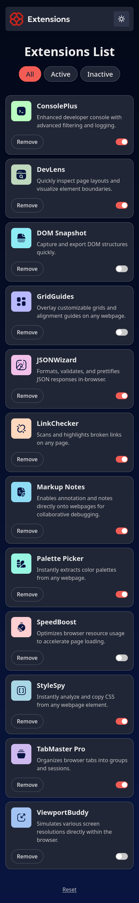
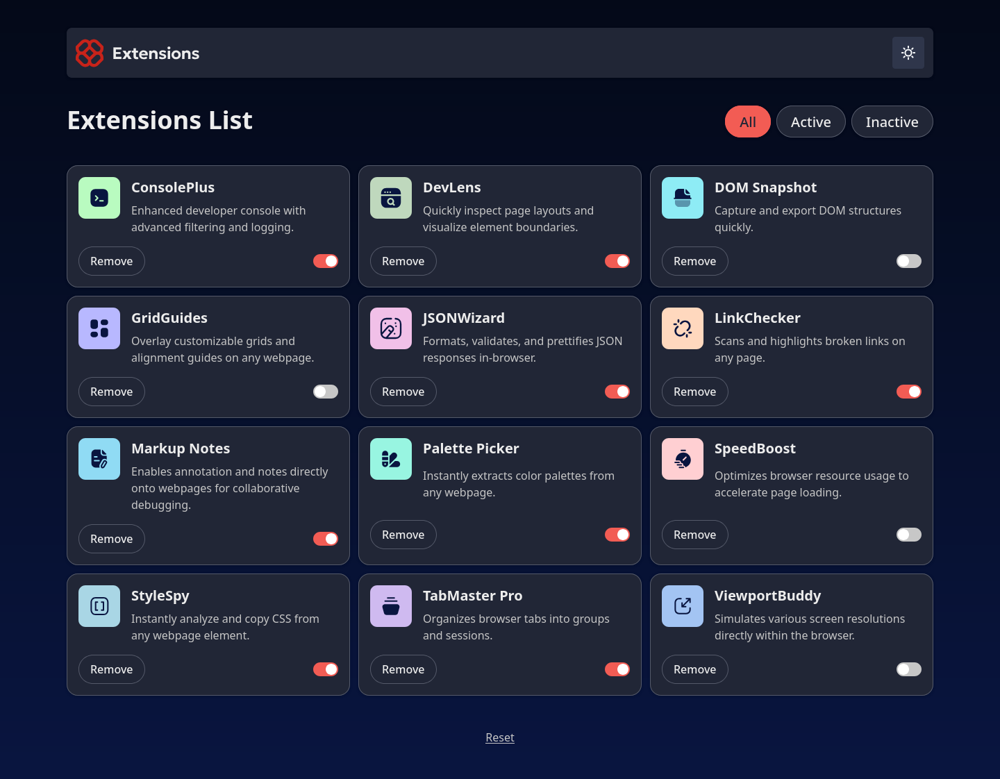

# Frontend Mentor - Browser extensions manager UI solution

This is a solution to the [Browser extensions manager UI challenge on Frontend Mentor](https://www.frontendmentor.io/challenges/browser-extension-manager-ui-yNZnOfsMAp).

## The challenge

Users should be able to:

- Toggle extensions between active and inactive states
- Filter active and inactive extensions
- Remove extensions from the list
- Select their color theme
- View the optimal layout for the interface depending on their device's screen size
- See hover and focus states for all interactive elements on the page

## Built with

- Semantic HTML5 markup
- Flexbox
- CSS Grid
- [React](https://reactjs.org/)
- [Tailwindcss](https://tailwindcss.com/)
- [Vite](https://vite.dev/)

## Highlights

- I extracted the core API to a separate module `extensions.ts`.

- The extensions are sorted by name when displayed.

- The list of extensions is loaded from `localStorage` (a hard coded list is used the first time):

```js
function loadExtensions(storage?: Storage): Extension[] {
    const storedValue = storage?.getItem("extensions");

    if (storedValue) {
        try {
            return JSON.parse(storedValue);
        } catch (error: any) {
            console.error(error.message);
        }
    }

    return [..._extensions];
}
```

```js
const [extensions, setExtensions] = useState(loadExtensions(window.localStorage));
```

- The list of extensions is saved on `localStorage`:

```js
function saveExtensions(extensions: Extension[], storage?: Storage) {
    try {
        storage?.setItem("extensions", JSON.stringify(extensions));
    } catch (error: any) {
        console.error(error.message);
    }
}
```

- I added a button to reset the list to the initial value.

## Useful resources

- [How to import SVG files as React components with Vite](https://cassidoo.co/post/svg-react-vite/)
- [Dark mode with tailwindcss](https://tailwindcss.com/docs/dark-mode)
- [How to detect a user’s preferred color scheme in JavaScript](https://developer.mozilla.org/en-US/docs/Web/API/Window/matchMedia)

## Continued development

With more time:

- I would put more effort into the design.
- Change the theme (dark / light mode) automatically when it is changed at the OS level.

## Screenshots




